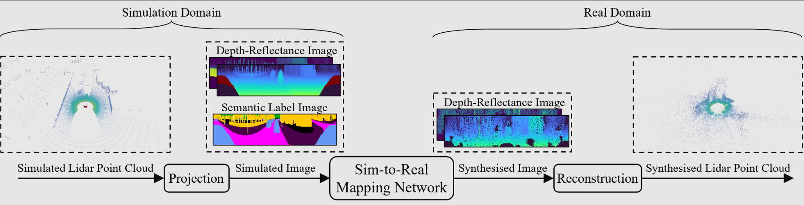
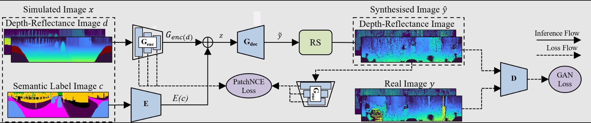

# Contrastive Learning-Based Framework for Sim-to-Real Mapping of Lidar Point Clouds in Autonomous Driving Systems
This repository mainly contains the Semantic-CARLA dataset and the implementation of the CLS2R framework explained in our [paper](https://arxiv.org/abs/2312.15817).

<p align="center"></p>
<p align="center"></p>

## Table of Contents
- [Installation](#installation)
- [Training](#training)
- [Testing & Visualisation](#testing--visualisation)
- [Rangenet++ Experiments](#rangenet-experiments)
- [Acknowledgements](#acknowledgements)

## Installation
### Dependencies
- Create a conda environment and activate it.
    ```
    conda create --name cls2r python=3.6
    ```


    ```
    conda activate cls2r
    ```
- Install PyTorch following [official instructions](https://pytorch.org/get-started/locally/)

The code has been tested on Ubuntu 18.04 with CUDA 12.1 and Pytorch 1.8.1.

- Install other Python packages listed in requirements.txt
    ```
    pip install -r requirements.txt
    ```
### Dataset
- Download our [Semantic-CARLA Dataset](https://livewarwickac-my.sharepoint.com/:u:/g/personal/u2039803_live_warwick_ac_uk/EeeNrNQ7nZRFpVd5wgIIkQQB8CSWSZE3j7uFvi3L2bpBcg?e=GW93yL) and unzip it.

## Training
 
- Set the dataset parameters for the real dataset of your choice, e.g. kitti, in the `configs/dataset_cfg/[DATASET_NAME]_cfg.yaml` file. You also need to set the parameters of the simulated Semantic-CARLA dataset in  `configs/dataset_cfg/carla_cfg.yaml`. 

- Set the training parameters for the image-to-image translation model of your choice, e.g. cut, in the `configs/train_cfg/[MODEL_NAME].yaml` file.

- Run the training code using:

```
python train.py --cfg configs/train_cfg/[MODEL_NAME].yaml 
```
The log of the training, including tensorboard plots and the model weights are saved in **checkpoints/[EXP_NAME]**.

## Testing & Visualisation 

- To test the model for calculating evaluation metrics including 'pixelAcc' on the test set, run:

```
python train.py --cfg checkpoints/[EXP_NAME]/[MODEL_NAME].yaml --test
```

- To visualise the outputs of the trained model in the image-based and point cloud representations, run:

```
python log_output.py --cfg checkpoints/[EXP_NAME]/[MODEL_NAME].yaml --ref_dataset_name [DATASET_NAME]
```


## Rangenet++ Experiments

- To reproduce the experiments regarding the training of the rangenet++ model, first, create the dataset synthesised by the model:

```
python infer_dataset.py --cfg checkpoints/[EXP_NAME]/[MODEL_NAME].yaml --data_folder [DATASET_DIR]
```
- Change your current directory to `rangenet/tasks/semantic/`.

- Then, set the rangnet++ backbone parameters in `config/arch/[BACKBONE].yaml`.

- set the training dataset's label parameters in `config/[DATASET_NAME].yaml`.

- Finally, run:
```
python train.py --dataset [DATASET_DIR] -a config/arch/[BACKBONE].yaml -dc config/labels/[DATASET_NAME].yaml
```

## Acknowledgements

- CUT, Unet, and CycleGAN Implementation from [taesungp](https://github.com/taesungp/contrastive-unpaired-translation)

- GcGAN implementation from [hufu6371](https://github.com/hufu6371/GcGAN)

- Raydrop Synthesis implementation from [kazuto1011](https://github.com/kazuto1011/dusty-gan)

- Rangenet++ implementation from [PRBonn](https://github.com/PRBonn/lidar-bonnetal)
 
