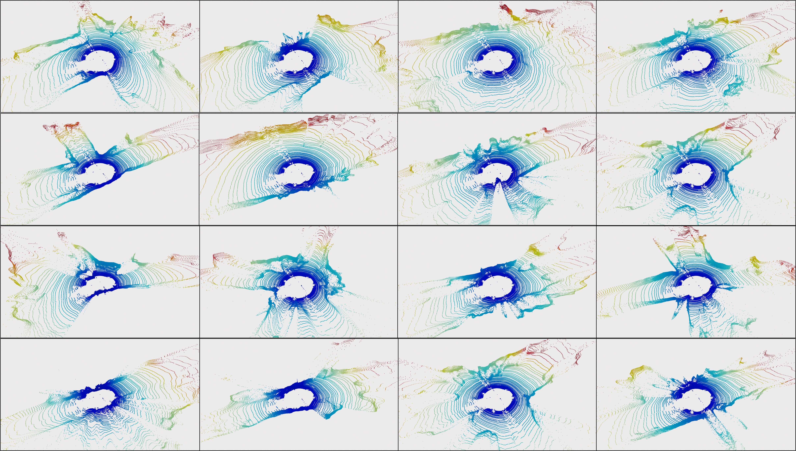
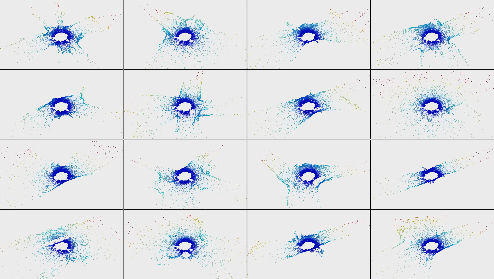

# Taming Transformers for Realistic Lidar Point Cloud Generation
This repository mainly contains the implementation of the [LidarGRIT](https://arxiv.org/pdf/2404.05505.pdf) and extended visualisation of generated samples.

<!-- <p align="center"></p>
<p align="center"></p> -->

## :bookmark_tabs: Table of Contents
- [Installation](#gear-installation)
- [Training](#train2-training)
- [Testing](#test_tube-testing)
- [Visualisation of Generated Samples](#bar_chart-visualisation-of-generated-samples)
- [Acknowledgements](#books-acknowledgements)


## :gear: Installation
### Dependencies
- Install Anaconda and create a conda environment and activate it.
    ```
    conda env create -f environment.yml
    ```


    ```
    conda activate LidarGRIT
    ```

## :train2: Training
 
- Set the dataset parameters for the real dataset, e.g. kitti-360, in the `configs/dataset_cfg/kitti_360_cfg.yaml` file. 

- Set the training parameters for the VQ-VAE model in `configs/train_cfg/vqgan_360.yaml` and for the transformer model in `configs/train_cfg/transformer_360.yaml` files (for kitti-360).

- To train VQ-VAE run:

```
python train.py --cfg configs/train_cfg/vqgan_360.yaml  --ref_dataset_name kitti_360
```

- To train the auto-regressive transformer run:

```
python train.py --cfg configs/train_cfg/transformer_360.yaml --ref_dataset_name kitti_360
```
The log of the training, including tensorboard plots and the model weights are saved in **checkpoints_kitti_360/[EXP_NAME]** for VQ-VAE and **checkpoints_trans_kitti_360/[EXP_NAME]** for the transformer.

## :test_tube: Testing 

- To get the results for LidarGRIT KITTI-360 generation, first you need to run the training to get the statistics of real data. You can do that by running the training in the fast mode:

```
python train.py --cfg configs/train_cfg/vqgan_360.yaml  --ref_dataset_name kitti_360 --fast_test
```
The  statistics of real data (on test split) are created in **./stats** and  **./stats/fpd_stats** as pickle files.

 Then, download the model checkpoints from [here](https://drive.google.com/file/d/1zW5lmsy7dNx1tW252TN1KMcXDAi1FRpx/view?usp=sharing) and extract the zip file to the projet root. You will see two directories for VQ-VAE checkpoint **checkpoints_kitti_360/[EXP_NAME]** and transformer checkpoint  **checkpoints_trans_kitti_360/[EXP_NAME]**. Download our generated samples from [here](https://drive.google.com/file/d/101l5DnpqRwHXZTE9irFTMikki1Pa8E9e/view?usp=sharing) or you can also generate samples using transformer model running:

```
python train.py --cfg checkpoints_trans_kitti_360/[EXP_NAME]/transformer_360.yaml --ref_dataset_name kitti_360 --test
```
The samples will be saved as torch tesnors containing range images (with ".pth" extension) in **checkpoints_trans_kitti_360/[EXP_NAME]/samples_5000/**.

- To evaluate the generation from the samples generated (on all metrics except FPD) or other SOTA samples (e.g. LidarGen) use:

```
python evaluate_from_samples.py --sample_dir checkpoints_trans_kitti_360/[EXP_NAME]/samples_5000/  --data_dir stats/kitti_360_n_512_64\*1024_data_dict.pkl --ref_dataset_name kitti_360
```
- To calucluate the FPD use:

```
python evaluate_from_samples.py --sample_dir checkpoints_trans_kitti_360/[EXP_NAME]/samples_5000/  --data_dir stats/kitti_360_n_512_64\*1024_data_dict.pkl --ref_dataset_name kitti_360 --fpd
```
## :bar_chart: Visualisation of Generated Samples 
### KITTI-360



### KITTI odometry



## :books: Acknowledgements

- VQ-VAE and transformer Implementation from [CompVis](https://github.com/CompVis/taming-transformers)

- Raydrop estimation inspired by [kazuto1011](https://github.com/kazuto1011/dusty-gan)

 ## :books: Citation

```bibtex
@misc{haghighi2024taming,
      title={Taming Transformers for Realistic Lidar Point Cloud Generation}, 
      author={Hamed Haghighi and Amir Samadi and Mehrdad Dianati and Valentina Donzella and Kurt Debattista},
      year={2024},
      eprint={2404.05505},
      archivePrefix={arXiv},
      primaryClass={id='cs.CV' full_name='Computer Vision and Pattern Recognition' is_active=True alt_name=None in_archive='cs' is_general=False description='Covers image processing, computer vision, pattern recognition, and scene understanding. Roughly includes material in ACM Subject Classes I.2.10, I.4, and I.5.'}
}
```
 
